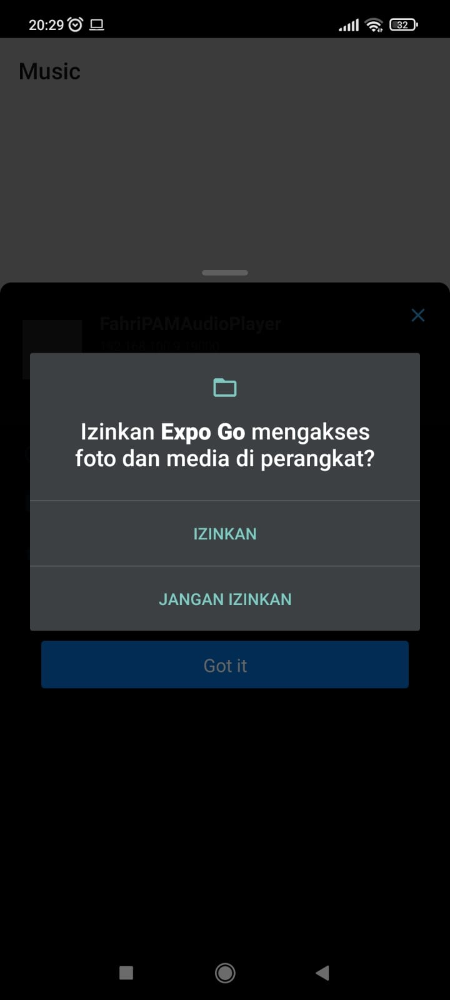
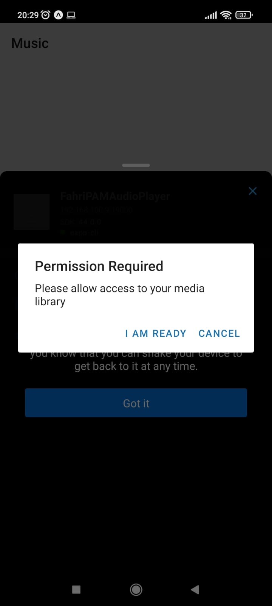
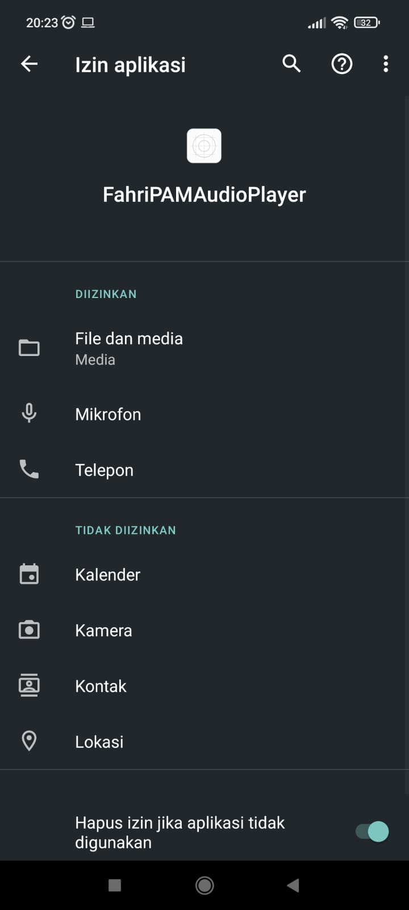
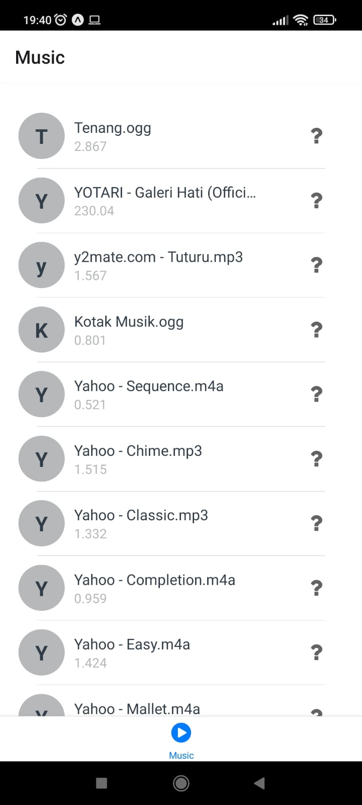
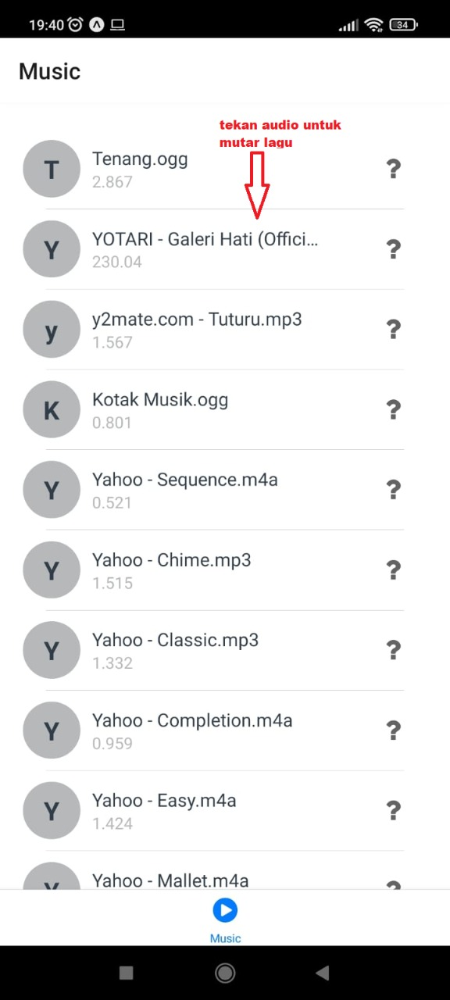
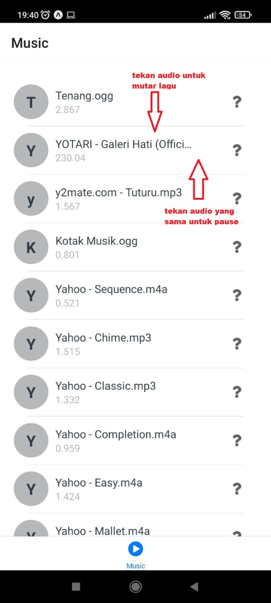
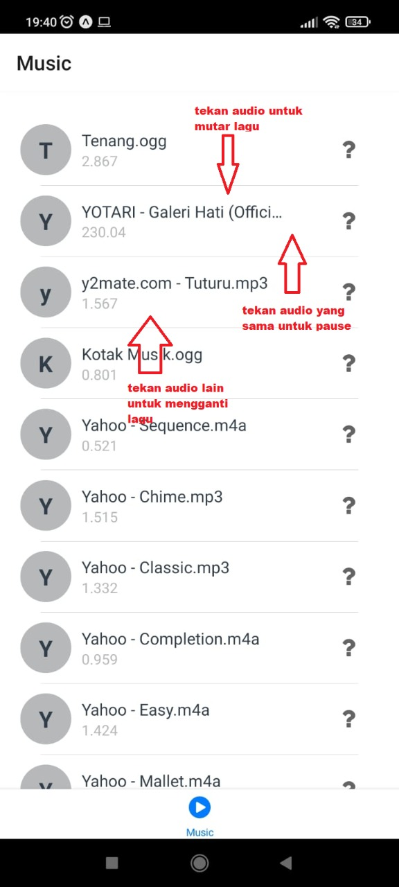
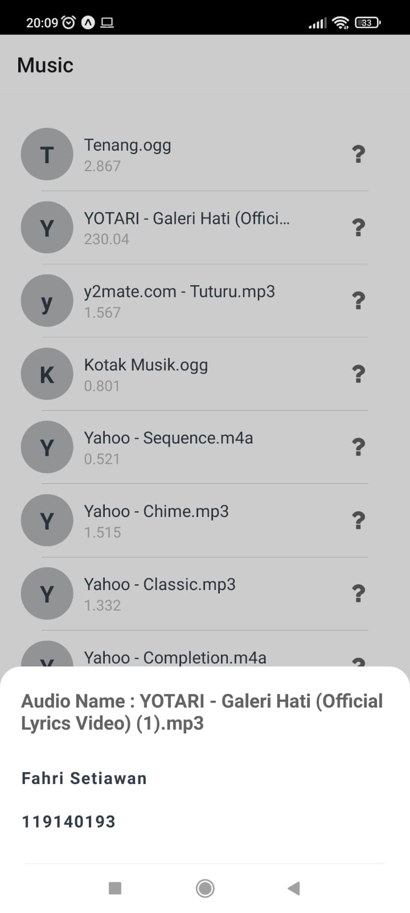

# Identitas mahasiswa

Nama : Fahri Setiawan

NIM  : 119140193

Kelas: PAM RD

# Penjelasan Aplikasi
Aplikasi audio player yang dapat digunakan untuk memutar audio di smartphone anda , pertama aplikasi akan meminta persetujuan pengguna untuk mengakses file data media library, ketika sudah diberikan akses aplikasi akan memindai seluruh file audio yang anda miliki dan akan di tampilkan pada list item audio yang bisa diputar, dengan menekan item audio tersebut aplikasi akan memutar audio yang di tekan, tekan audio yang sama untuk pause dan tekan lagi untuk resume . untuk memilih audio lain yang ingin diputar tinggal tekan item audio berbeda.

Framework dan aplikasi pendukung yang digunakan dalam membangun aplikasi ini:
1.React Native (Expo).
2.Android Studio.
3.Visual Code Studio.

Library yang digunakan pada aplikasi ini:
1. expo-media-library
2. expo-av
4. expo-status-bar
5. expo/vector-icons
6. expo-updates
7. react-navigation/bottom-tabs
8. react-native
9. recyclerlistview

# Cara Instalasi
1. Download terlebih dahulu aplikasi pada link berikut https://drive.google.com/file/d/1r96fKPdAv5-X_RW3pfgzN34WycL403Mo/view?usp=sharing dan  https://github.com/mochile6/TugasPAM4-AudioPlayer 
2. Selanjutnya instal aplikasi yang telah didownload di hp android.
3. Aplikasi siap digunakan.

# Cara Penggunaan
<b>1. Buka aplikasi Audio Player lalu aplikasi akan meminta akses ke media library.</b>

<b>2. ketika aplikasi tidak diberikan izin maka akan muncul pop up seperti di bawah ini</b>

<b> tekan tombol i am ready jika ingin memberikan akses kepada aplikasi</b>

<b>3. gambaran permission ketika aplikasi sudah diberikan akses ke file and media </b>

<b>4. Halaman Utama Setelah Memberikan Akses Kepada Aplikasi </b>

<b>5. memulai audio dengan menekan salah satu item  </b>

<b>6. Pause Audio  </b>

<b>7. Resume Audio  </b>

<b>8. Play another audio  </b>

<b>9. Deskripsi Tombol Audio Item (?) ?  </b>

